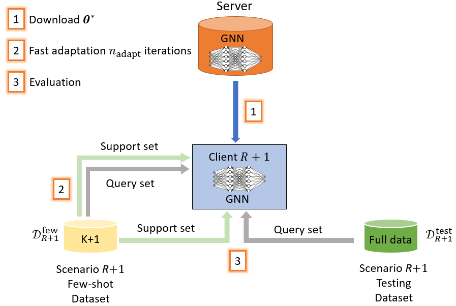

#  Fast-Adapting Environment-Agnostic Device-Free Indoor Localization via Federated Meta-Learning

## Introduction:
This paper proposes a federated metalearning framework for device-free indoor localization, where each client, representing an environment or task, collaboratively train a general environment-agnostic model while preserving their data privacy.

This code is for paper : 
B.-J. Chen, R. Y. Chang, and H. Vincent Poor, "Fast-Adapting Environment-Agnostic Device-Free Indoor Localization via Federated Meta-Learning," IEEE International Conference on Communications (ICC), May 2023.

## Dataset:
precollected CSI data from two different scenarios.

## Conception:
### system setup

### model structure

## Execution:
Train for GNN with k-shot

`python main.py`

In trainer.py, the initialized function of class Trainer() can be defined as what you want. Decide which client is CenterServer to be the testing client and the other clients are training clients. Also, self.num_shot is self-defined for training and testing.

## Experiement Result:

### Comparison with centralized learning (mate-learning/centralized learning)
| Testing client                 |       1-shot      |      5-shot      |      10-shot     |
|              :---:             |       :---:       |       :---:      |       :---:      |
| **Dataset A**                  | 49.16%/63.96% | 70.05%/80.95% | 78.34%/82.37% |
| **Dataset B**                  | 28.91%/45.45% | 48.76%/54.62% | 58.76%/54.69% | 
| **Dataset C**                  | 58.19%/61.50% | 67.78%/82.28% | 75.17%/92.03% | 
| **Dataset D**                  | 46.93%/57.51% | 74.90%/78.92% | 75.27%/80.67% |

## Dependencies:

- python==3.9.7
- torch==1.9.0+cu102
- numpy==1.21.1
- sklearn==0.24.2

## Contact:
Bing-Jia Chen, r11942023@ntu.edu.tw
